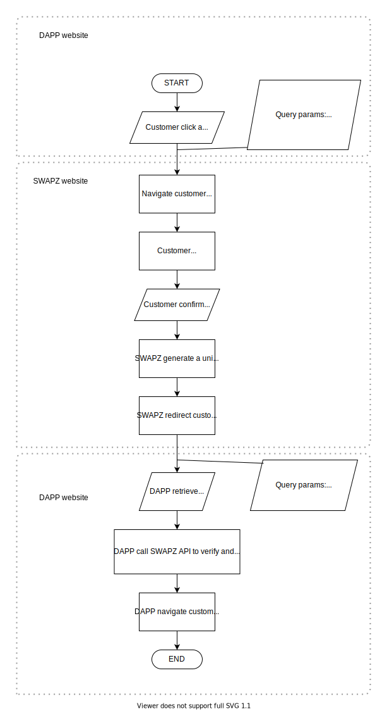

# Bind Wallet

You may allow your customer to bind their account with SWAPZ to utilize the APIs & features provided by SWAPZ. Besides, you may treat this as a login feature as well.

## Flowchart

## Processing Step
1. Customer decide to bind wallet.
2. DAPP generate bind wallet [query parameters](#implementation).
3. DAPP redirect the customer to [SWAPZ bind wallet page](#implementation) with the generated query parameters.
4. Customer required to login to the SWAPZ account he/she wanted to bind with.
5. Customer confirms bind wallet.
6. SWAPZ generate a unique JWT for this customer.
7. SWAPZ redirect customer back to DAPP website with the URL provided in the query parameter `redirect` with the JWT provided.
8. DAPP retrieve the [JWT](#bind-wallet-return) from the query parameter.
9. DAPP [verify](#get-customers-swapz-detail) customer's SWAPZ details and record necessary data in the database.
10. Lastly, DAPP navigates customer to the designated page.

### Important informations
- One SWAPZ account can only bind with one account in the same DAPP.
- In step 4, if the customer login to an account that is already bound with one of your DAPP's customer account, the customer data you receive in step 9 will belongs to the bound account. Therefore, DAPP must verify that the [`userDappToken`](#get-customers-swapz-detail) is new and unique.

## Bind Wallet URL
All you need to do here is to redirect customer to SWAPZ bind wallet page with the query parameters required.

### Implementation

**Example URL**
Production: https://swapz.finance/bindwallet?redirect=https://superweb.com/profile&H4gyoS8bYnUZRwuzwenA=2531280552858748517 

Staging: https://staging.swapz.finance/bindwallet?redirect=https://superweb.com/profile&H4gyoS8bYnUZRwuzwenA=2531280552858748517

**Parameter (Query)**

|Parameter|Mandatory|Description|
|--- |--- |--- |
|redirect|Yes|URL that SWAPZ will be using to navigate customer after customer confirmed bind wallet or any error occurred|
|H4gyoS8bYnUZRwuzwenA|Yes|DAPP ID. This decides the DAPP that the customer is binding with. DAPP ID can be found in [SWAPZ My DAPP Page](https://swapz.finance/app/mydapp)|

## Bind Wallet Return
Customer will be redirected to the URL provided in the query parameter in [Bind Wallet URL](#implementation). If the bind wallet process success, a unique JWT will be returned in the query parameter.

**Parameter (Query)**

|Parameter|Mandatory|Description|
|--- |---|--- |
|nFHRy2gcdlkJxCGEykk2|Yes|A unique JWT that allows DAPP to query for customer's SWAPZ details|

## Get Customer's SWAPZ detail
DAPP should store the data acquired from this API instead of the [JWT](#bind-wallet-return). This is because all the APIs & features are available using `userDappToken` that you will receive from this API.

### Implementation

**HTTP Request:**  
`GET /dapp/customer/profile`

**Parameter (Headers)**

|Parameter|Mandatory|Description|
|--- |---|--- |
|authorization|Yes|The JWT DAPP retrieve from [Bind Wallet Return](#bind-wallet-return)|

**Parameter (Query)**

|Parameter|Mandatory|Description|
|--- |---|--- |
|dappId|Yes|DAPP ID can be found in [SWAPZ My DAPP Page](https://swapz.finance/app/mydapp)|

**Response:**  

|Parameter|Data Type|Description|
|--- |---|--- |
|email|string|Customer's SWAPZ email|
|userDappToken|string|Customer's unique token. This token is needed in the rest of the APIs & features related to SWAPZ customer|
