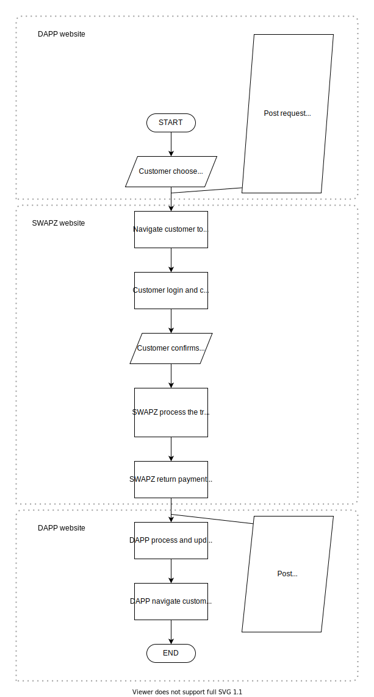

# Customer Payment

## Flowchart


## Transaction Processing Step
1. Customer chooses to pay with SWAPZ.
2. DAPP generate all the payment details and signature with the Private Key saved previously in [Pre-requisite of DAPP Integration](#pre-requisite-of-dapp-integration).
3. DAPP sends HTTPS POST Request (Payment Request URL) containing payment details (parameters) and signature to SWAPZ.
4. SWAPZ perform verification and redirect Customer to SWAPZ's payment page.
5. Customer login to the SWAPZ account that is going to pay for the payment.
6. Customer confirms the payment.
7. Customer views the payment status & details.
8. SWAPZ returns the payment status to DAPP by sending HTTPS POST Request (Response URL) with the payment details (parameters) including a signature.
9. DAPP verify the response's signature and update the payment status wherever are required in DAPP system.
10. Lastly, redirect the customer to a designated page.

** Note: If the customer cancels the payment at step 6, the remaining steps still are proceeded with a status of payment failed.

## Payment Request
DAPP request SWAPZ for payment. SWAPZ will create a transaction and redirect customer to SWAPZ's payment page to pay.  

### Implementation

**HTTP Request:**  
`POST /dapp/v1/createtransaction`

**Parameter (Payload):**  

|Parameter|Data Type|Mandatory|Default|Description|
|--- |--- |--- |--- |--- |
|dappApiKey|string|Yes|-|The dappApiKey provided by SWAPZ and use to uniquely identify the DAPP|
|timestamp|string|Yes|-|UNIX EPOCH timestamp|
|signature|string|Yes|-|Refer [API Signature Authentication](#api-signature-authentication)|
|orderId|string|Yes|-|Unique DAPP Order/Transaction ID|
|amount|string|Yes|-|Payment amount without formatting (i.e. thousand separator, decimals)<br/>**Example:**<br/>Before: 120.50 USDT<br/>After: 120500000<br/>(USDT has 6 divisibility)|
|tokenId|string|Yes|-|Cryptocurrency ID. Refer [Token List](CodeList.md#token)|
|chain|string|Yes|-|The chain of selected cryptocurrency (tokenId). Refer [Token List](CodeList.md#token)|
|productDesc|string|No|`''`|Product/transaction description|
|userName|string|No|`''`|Customer name|
|userEmail|string|No|`''`|Customer email|
|userContactNo|string|No|`''`|Customer contact number. If `userContactNo` is provided, `userCountryCode` must be provided as well.|
|userCountryCode|string|No|`''`|Customer contact number's country code. Refer [Country Code List](CodeList.md#country-code)|
|remark|string|No|`''`|DAPP remarks|
|lang|string|No|`'en'`|Language used by customer. Refer [Language Code List](CodeList.md#language)|
|responseUrl|string|Yes|-|Payment response page URL to receive payment status from SWAPZ. Please make sure that the URL origin is match with the website you have entered in [creation of DAPP](Introduction.md#steps-to-create-dapp). |
|backendUrl|string|Yes|-|Backend response page URL. Refer [Backend POST Feature](#backend-post-feature)|

### Sample
```
<html>
    <body>
        <form method="post" name="createtransaction"
        action="https://swapz.finance/dapp/v1/createtransaction">
            <input type="hidden" name="dappApiKey" value="2225183471253333333"/>
            <input type="hidden" name="timestamp" value="1604659137"/>
            <input type="hidden" name="signature" value="a121af9460cbb1b94700c6f1c5f6404cf5a2ffc7310e22d0a"/>
            <input type="hidden" name="orderId" value="ABC202005140001"/>
            <input type="hidden" name="amount" value="100"/>
            <input type="hidden" name="tokenId" value="usdt"/>
            <input type="hidden" name="chain" value="eth"/>
            <input type="hidden" name="prodDesc" value="Movie ticket"/>
            <input type="hidden" name="userName" value="Christopher Tan"/>
            <input type="hidden" name="userEmail" value="christan@gmail.com"/>
            <input type="hidden" name="userContactNo" value="0123466777"/>
            <input type="hidden" name="userCountryCode" value="MY"/>
            <input type="hidden" name="Remark" value=""/>
            <input type="hidden" name="lang" value="en"/>
            <input type="hidden" name="responseURL" value="https://superweb.com/payment/response"/>
            <input type="hidden" name="backendURL" value="https://superweb.com/payment/backend"/>
            <input type="submit" value="Proceed with Payment" name="Submit"/>
        </form>
    </body>
</html>
```
**Note:** Do not copy and paste the code above as it just a reference only

## Payment Response
After customer complete the payment on SWAPZ website, SWAPZ will return the payment status to DAPP through the `responseURL` provided in [Payment Request](#payment-request).

### Implementation

**HTTP Request:**  
`POST https://superweb.com/payment/response` (Example of `responseURL`)

**Parameter (Payload):**  

|Parameter|Data Type|Mandatory|Description|
|--- |--- |--- |--- |
|dappApiKey|string|Yes|The dappApiKey provided by SWAPZ and use to uniquely identify the DAPP|
|timestamp|string|Yes|UNIX EPOCH timestamp|
|signature|string|Yes|Refer [API Signature Authentication](#api-signature-authentication)|
|orderId|string|Yes|Unique DAPP transaction ID|
|amount|string|Yes|Payment amount without formatting (i.e. thousand separator, decimals)<br/>**Example:** 120500000<br/>(USDT has 6 divisibility)|
|tokenId|string|Yes|Digital asset symbol. Refer [Token List](CodeList.md#token)|
|remark|string|No|DAPP remarks|
|transId|string|Yes|SWAPZ Transaction ID|
|status|string|Yes|Payment Status. Refer [Return Code List](CodeList.md#return-code)|
|errorDesc|string|No|Payment Status Description|

### Sample

#### ASP Sample Code
```
<%
    DappApiKey    = Request.Form("dappApiKey")
    Timestamp     = Request.Form("timestamp")
    Signature     = Request.Form("signature")
    OrderId       = Request.Form("orderId")
    Amount        = Request.Form("amount")
    TokenId       = Request.Form("tokenId")
    Remark        = Request.Form("remark")
    TransId       = Request.Form("transId")
    Status        = Request.Form("status")
    ErrorDesc     = Request.Form("errorDesc")
%>

<Add your programming code here>

IF Status=1 THEN
    // update order to PAID
    response.write "Thank you for payment."
ELSE
    // update order to FAIL
    response.write "Payment fail."
```

#### PHP Sample Code
```
<?PHP
    $dappapikey    = $_REQUEST["dappApiKey"];
    $timestamp     = $_REQUEST["timestamp"];
    $signature     = $_REQUEST["signature"];
    $orderid       = $_REQUEST["orderId"];
    $amount        = $_REQUEST["amount"];
    $tokenid       = $_REQUEST["tokenId"];
    $remark        = $_REQUEST["remark"];
    $transid       = $_REQUEST["transId"];
    $status        = $_REQUEST["status"];
    $errordesc     = $_REQUEST["errorDesc"];
PHP?>

<Add your programming code here>

IF ($status=1) {
    // update order to PAID
    echo "Thank you for payment.";
}
ELSE {
    // update order to FAIL
    echo "Payment fail.";
}
```
**Note:** You may implement this in any way you want as long as the implementation serves the same purpose.

## Backend POST Feature
The Backend POST feature is a server to server technology where it does not depend on the customer’s web browser to return payment response data to DAPP website. With this feature implemented, your system still can receive the payment status on the backend (asynchronously) even if the DAPP normal response page fails to receive status from SWAPZ which may be due to a closed web browser, internet connection timeout and etc.

 - Please make sure that the URL origin is match with the website you have entered in [creation of DAPP](Introduction.md#steps-to-create-dapp).
- This backend POST feature will **ONLY** return status if the transaction's status is **success**. No status will return if the payment is **failed**.
- The Backend page should implement checking same like response page such as signature checking, and etc., to prevent user hijack DAPP system.
- The backend page should not have session related code so that DAPP systems are still able accept payment status from SWAPZ even if the customer is logged out or the session is expired.
- The backend page is **not** a replacement for the response page. You will still need to continue to use the normal response page as usual.

### Implementation

On the DAPP website, create another page or API to receive backend POST response parameters from SWAPZ. The return backend post response parameters are the same as normal [response page parameters](#payment-response). You must specify the backend POST URL with `backendURL` parameter on the [Payment Request page](#payment-response).

On this page/API, you need to write out/return the word **`RECEIVEOK`** as an acknowledgement once this page/API success receive the payment status from SWAPZ and update status to success on wherever are required in DAPP system.

If you are creating a page for this purpose, ensure just the word **`RECEIVEOK`** only on the backend page and **without** any HTML tag on the page.

SWAPZ will re-try send the payment status to the `backendURL` up to 3 times every minute if no **`RECEIVEOK`** acknowledgement detected/received.

Example:  
In ASP >> `response.write "RECEIVEOK"`  
In PHP >> `echo "RECEIVEOK"`  
If you are using API, just return `"RECEIVEOK"` at the end of your API.

**Note:** The parameter (payload) receive from this Backend POST is the same as [payment response](#payment-response).

### Sample

#### ASP Sample Code
```
<%
    DappApiKey    = Request.Form("dappApiKey")
    Timestamp     = Request.Form("timestamp")
    Signature     = Request.Form("signature")
    OrderId       = Request.Form("orderId")
    Amount        = Request.Form("amount")
    TokenId       = Request.Form("tokenId")
    Remark        = Request.Form("remark")
    TransId       = Request.Form("transId")
    Status        = Request.Form("status")
    ErrorDesc     = Request.Form("errorDesc")
%>

<Add your programming code here>

IF Status=1 THEN
    // update order to PAID
    response.write "RECEIVEOK"
ELSE
    // update order to FAIL
```

#### PHP Sample Code
```
<?PHP
    $dappapikey    = $_REQUEST["dappApiKey"];
    $timestamp     = $_REQUEST["timestamp"];
    $signature     = $_REQUEST["signature"];
    $orderid       = $_REQUEST["orderId"];
    $amount        = $_REQUEST["amount"];
    $tokenid       = $_REQUEST["tokenId"];
    $remark        = $_REQUEST["remark"];
    $transid       = $_REQUEST["transId"];
    $status        = $_REQUEST["status"];
    $errordesc     = $_REQUEST["errorDesc"];
PHP?>

<Add your programming code here>

IF ($status=1) {
    // update order to PAID
    echo "RECEIVEOK";
}
ELSE {
    // update order to FAIL
}
```


**Note:** You may implement this in any way you want as long as the implementation serves the same purpose.

## Re-query Payment Status
Re-query Payment Status Feature allow DAPP to re-query payment status from SWAPZ when to re-confirm the payment status. 

This feature can be implemented in the scenario below: 
- Every transaction will timeout in 5 minutes. DAPP may re-query for the payment status after 5 minutes if DAPP do not receive any response from [Response URL](#payment-response) or  [Backend POST Feature](#backend-post-feature).
### Implementation

**HTTP Request:**  
`POST /dapp/v1/requery`

**Parameter (Payload):**  

|Parameter|Data Type|Mandatory|Default|Description|
|--- |--- |--- |--- |--- |
|dappApiKey|string|Yes|-|The dappApiKey provided by SWAPZ and use to uniquely identify the DAPP|
|orderId|string|Yes|-|Unique DAPP Order/Transaction ID|
|amount|string|Yes|-|Payment amount without formatting (i.e. thousand separator, decimals)<br/>**Example:**<br/>Before: 120.50 USDT<br/>After: 120500000<br/>(USDT has 6 divisibility)|

**Response:**  

|Parameter|Data Type|Description|
|--- |--- |--- |
|c|int|Code. Refer the table below or [Return Code List](CodeList.md#return-code)|
|m|string|Message. Description or message of the return `c` parameter|

**Response Sample:**
```
{
    "c": 20000,
    "m": SUCCESSFUL,
}
```

**Possible response from SWAPZ:**  

|Code|Message|
|--- |--- |
|20000|Payment Successful|
|21000|Invalid DAPP API Key|
|21010|Record not found|
|21011|Invalid Amount|
|21012|Payment failed|