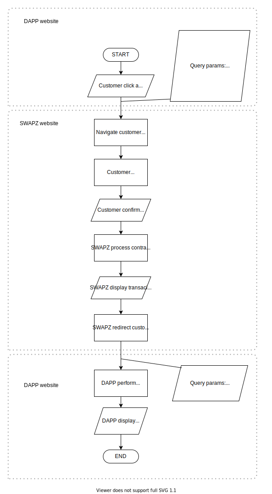

# DeFi Wallet
SWAPZ DeFi wallet currently supports Binance Smart Chain (BSC) protocol. User can perform transactions with BNB and any BEP20 standard tokens. We **strongly suggest** developer should test and perform a complete workflow on staging environment before production.

## Contract Calling
DAPP can perform decentralized transaction by navigating customer to SWAPZ's contract calling page with query parameters to call a contract on BSC.

## Flowchart

## Processing Step
1. Customer decide to call a contract.
2. DAPP generate required query parameters.
3. DAPP redirect the customer to SWAPZ contract calling page with the generated query parameters.
4. Customer login to the account with designated defi address. 
5. Customer confirms to broadcast the transaction to call the contract.
6. SWAPZ process and broadcast the transaction.
7. SWAPZ display the result. If the result is success, SWAPZ will display the transaction hash.
8. SWAPZ redirect customer back to DAPP website with the URL provided in query parameter [`returnUrl`](#implementation) with the result and transaction hash (if success = true).
9. DAPP perform any updates based on the result.
10. DAPP display the result or updates.

### Implementation

**Example URL**

Production: https://swapz.finance/defi/request?fromAddress=0x5ed9697cb5f169726210b6dcc3dc6fd81cc259fa&toContractAddress=0xbbf5ab6e21b89de1d8d2365e8b00c1cdafc64182&amount=0&data=0xa9059cbb000000000000000000000000bbf5ab6e21b89de1d8d2365e8b00c1cdafc641820000000000000000000000000000000000000000000000000000000005f5e100&gasLimit=60000&gasPrice=20&returnUrl=https://superweb.com/app/wallet
 
Staging: https://stagng.swapz.finance/defi/request?fromAddress=0x5ed9697cb5f169726210b6dcc3dc6fd81cc259fa&toContractAddress=0xbbf5ab6e21b89de1d8d2365e8b00c1cdafc64182&amount=0&data=0xa9059cbb000000000000000000000000bbf5ab6e21b89de1d8d2365e8b00c1cdafc641820000000000000000000000000000000000000000000000000000000005f5e100&gasLimit=60000&gasPrice=20&returnUrl=https://superweb.com/app/wallet

**Parameter (Query):**  

|Parameter|Data Type|Mandatory|Description|
|--- |--- |--- |--- |
|fromAddress|string|Yes|Customer's DeFi address|
|toContractAddress|string|Yes|The contract adddress that customer is going to call|
|amount|string|Yes|Amount of BNB to send to the contract address|
|data|hexadecimal|Yes|Any data in hexadecimal format to be include in the transaction|
|gasLimit|string|Yes|Maximum price that this transaction is going to pay for sending this transaction|
|gasPrice|string|Yes|Cost/fee to perform this transaction|
|returnUrl|string|Yes|URL that SWAPZ will be using to navigate customer after the process in SWAPZ is done|

## Contract Calling Return
Customer will be redirected to the URL provided in the [query parameter](#implementation) with the query parameters below.

**Parameter (Query):**  

|Parameter|Data Type|Mandatory|Description|
|--- |--- |--- |--- |
|success|string|Yes|True or false. Indicate the result of broadcasting the contract calling transaction|
|txHash|string|No|The hash of the broadcasted transaction. `txHash` will not be returned if the transaction is failed to broadcast|

