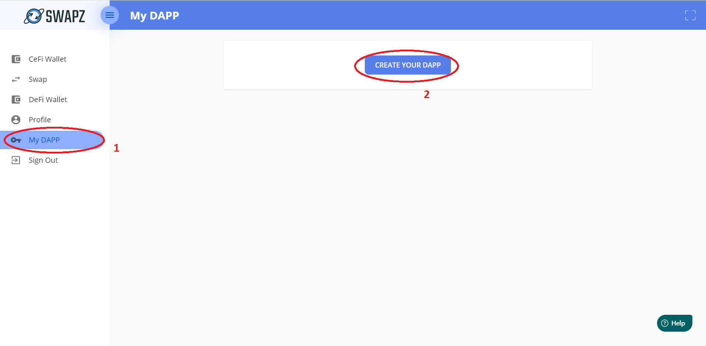
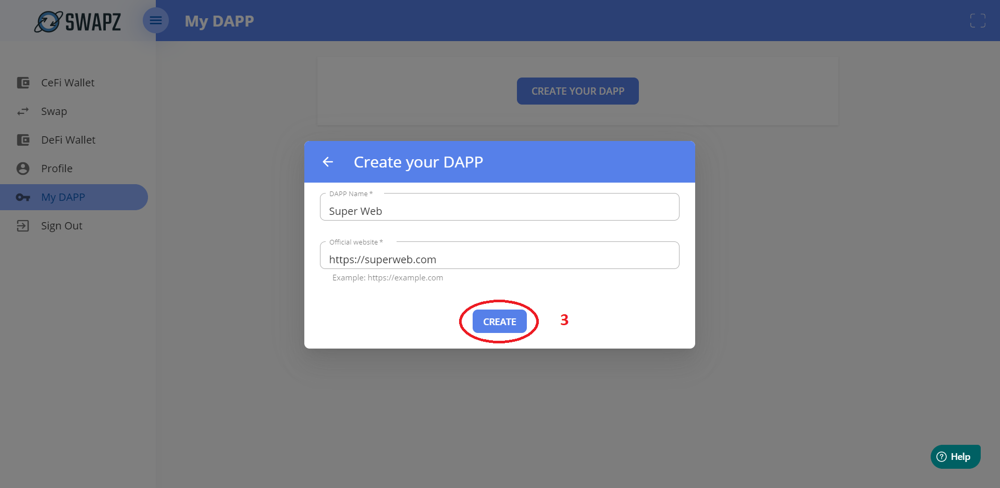
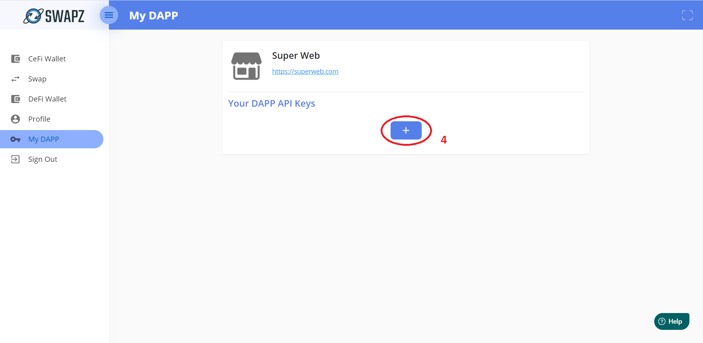
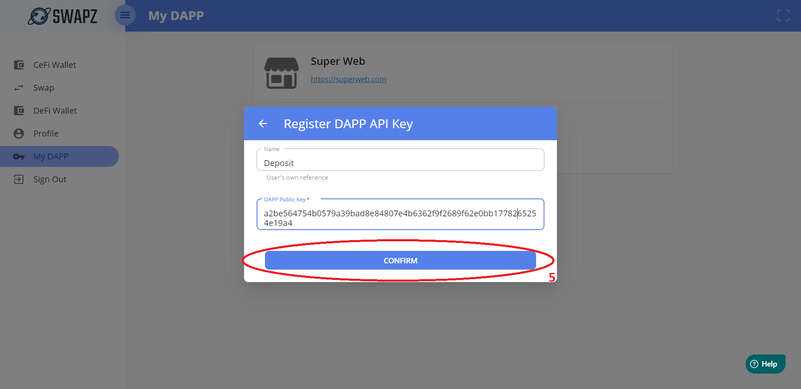
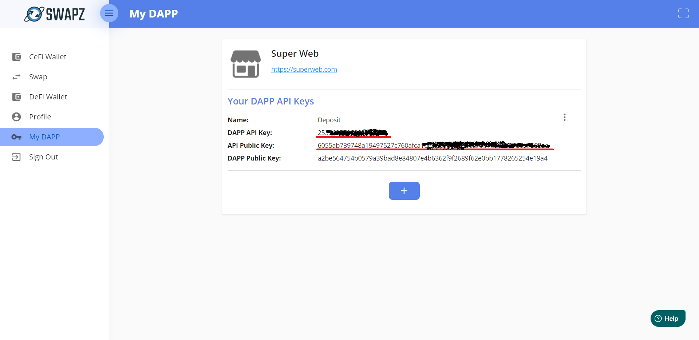

# Introduction
## About SWAPZ Cryptocurrency Payment
SWAPZ Cryptocurrency Payment System provides a cross-platform payment solution with cryptocurrencies. This document guides you through the functionalities of SWAPZ Cryptocurrency Payment System.

## Pre-requisite of DAPP Integration
Please follow the guidelines below before integration.
- Users are required [create a DAPP on SWAPZ](#steps-to-create-a-dapp) with all the [informations required](#information-required-for-dapp-integration). 
- Users need to generate set of Public & Private Keys by using ED25519 algorithm.
- Create your DAPP on SWAPZ to receive `dappApiKey` and `SWAPZ API Public Key`.

## Information Required to create a DAPP
<table>
<tr><th>Parameter</th><th>Sample</th><th>Description</th></tr>
<tbody>
<tr><td>DAPP Name</td><td>Super Web</td><td>Name of DAPP</td></tr>
<tr><td>Domain/Website</td><td>https://superweb.com</td><td>URL of DAPP's website. It will be used to verify the Response URL and Backend URL during integration. Please take note that do not leave a traling '/'.</td></tr>
<!-- <tr><td>Logo</td><td>-</td><td>Logo of DAPP</td></tr> -->
<tr><td>Dapp Public Key</td><td>-</td><td>Generated with ED25519 algorithm. It is used to verify the signature returned from SWAPZ.</td></tr>
<tbody>
</table>

## Steps to create a DAPP
Go to https://swapz.finance (Production) or https://staging.swapz.finance (Staging). Please log in to your account. If you do not have any SWAPZ's account, feel free to register one.

1. Click on **My DAPP** on the menu.
2. Click **CREATE YOUR DAPP** button to create a DAPP.

3. Enter your DAPP Name & Official website then click **CREATE** button. Please take note that these data will display on customer payment page.

4. Click **+** button under **Your DAPP API Keys** section to create API key.

5. Enter Name and DAPP Public Key, then click **CONFIRM** button. Take note that name is only for your own reference while  DAPP Public Key is the public key you generated in [Pre-requisite of DAPP Integration](#pre-requisite-of-dapp-integration)

6. Finally, you can retrive your `dappApiKey` & API Public Key from the list.

8. You may create more than one DAPP API Keys by repeating Step 4 to 5.

## Rule, Limitation and Constraint
- Service Hours: 7x24 exclude host down time